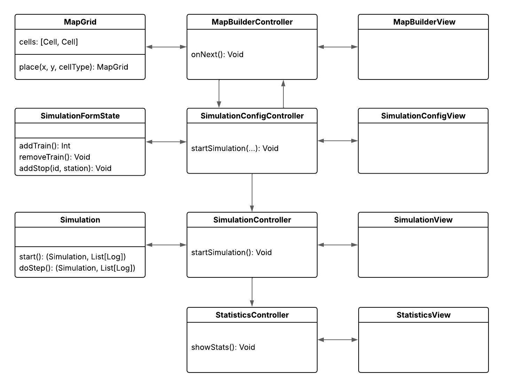
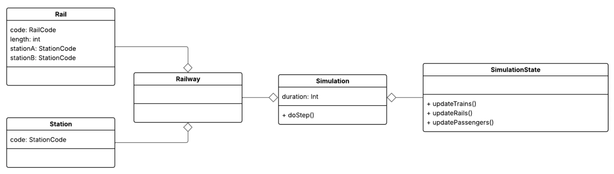

# Design architetturale

# Pattern Architetturale MVC

L'applicazione si divide in 4 parti principali:

- il configuratore della rete ferroviaria,
- l’interfaccia di configurazione della simulazione,
- il simulatore vero e proprio del traffico ferroviario,
- la visualizzazione delle statistiche di simulazione.

Per tutte le macro-sezioni abbiamo scelto di usare un’architettura **Model View Controller** con un collegamento tra i controller per passare da una view all’altra. Questo pattern garantisce una chiara separazione delle responsabilità all'interno del sistema, permettendo di modificare i componenti singoli in maniera indipendente, migliorando ad esempio la view in un secondo momento senza modificare il model.

# View

## MapBuilderView

Come intuibile dal nome offre all'utente l'interfaccia grafica per il posizionamento dei componenti di dominio in una griglia, così da comporre la rete ferroviaria.

All’interno dell’interfaccia è possibile impostare il budget di spesa massimo per la costruzione della rete.

## SimulationConfigView

L’interfaccia consente di configurare la simulazione, impostando i parametri principali e definendo i treni che percorreranno la rete ferroviaria.

## SimulationView

Consente di monitorare l’avanzamento della simulazione mostrando l’elenco dei log generati, nonché la posizione attuale di passeggeri e treni nello stato della simulazione.

La visualizzazione della rete ferroviaria è sempre presente, per fornire un riferimento costante alla sua struttura.

## StatisticsView

Mostra le statistiche della simulazione appena terminata e permette di scaricare il file con le stesse.

# Controller

Ogni controller ha il compito di fungere da tramite tra la view e la parte di model corrispondente, e di istanziare il controller successivo, condividendogli le informazioni del model necessarie allo step successivo.

## SimulationController

All’interno di questo controller è presente la logica di avvio ed avanzamento della simulazione, tramite un simulation loop asincrono che invoca i metodi di update della simulazione e di aggiornamento della view.

# Model

Il model del sistema deve essere una parte marcatamente funzionale, che sfrutta prevalentemente strutture dati e approcci immutabili.

## MapGrid

Esso rappresenta il modello statico della rete ferroviaria costruita tramite la `MapBuilderView` e rappresenta le informazioni tramite una griglia interna.

Tale model si occupa di controllare che i posizionamenti siano coerenti e che le regole di posizionamento degli elementi siano rispettate. Quando l'utente ha terminato di progettare la rete, tale modello statico a griglia viene trasformato in un oggetto `Railway` utilizzando la classe di utility `RailwayMapper` e passando tale oggetto al `SimulationConfigController` per avviare l’interfaccia di configurazione della simulazione.

Durante la conversione della MapGrid è anche presente una parte di controllo della rete ferroviaria implementata tramite Prolog.

### SimulationFormState

Il `SimulationFormState` è un modello di supporto per l’interfaccia di configurazione della simulazione che raccoglie gli input utente anche quando si trovano in uno stato inconsistente. È utilizzato per poter memorizzare e gestire in maniera incrementale le configurazioni dei treni `TrainConfig`, permettendo di fare controlli preventivi sulla creazione degli stessi, in particolare in relazione alla `Railway` come la selezione di stazioni irraggiungibili. Da questo verrà creato il model `Simulation` con i treni effettivi e le loro tratte.

## Simulation

Per la parte di simulazione, sarà necessario mantenere separate le informazioni statiche, come la struttura fisica della rete ferroviaria (`Railway`), dalle informazioni dinamiche che mutano al progredire della simulazione, costituendo lo stato (`SimulationState`). Il model della simulazione dovrà mantenere anche la durata totale, il meccanismo di generazione passeggeri e il criterio di scelta degli itinerari.

Il `SimulationState` dovrà tenere in considerazione gli stati dei treni, dei binari e dei passeggeri, prevedendo i meccanismi di aggiornamento durante la simulazione. Lo stato del treno (`TrainState`) sarà costituito dalla posizione corrente, che può essere in una stazione o su un binario, e dalle informazioni necessarie a tracciare il suo percorso, permettendo quindi di decidere se proseguire su un binario, rimanere fermo ad una stazione o entrare in una stazione. Per quanto riguarda i binari, il loro stato (`RailState`) consiste nell’identificare se un binario libero o è occupato da un treno e se è guasto. 

La simulazione prevede anche la gestione dei passeggeri tramite un oggetto di utility `PassengerGenerator` che ha il compito di generare passeggeri casuali scegliendo per ognuno partenza, destinazione e un itinerario possibile (seguendo il criterio di scelta degli itinerari).

Ogni passeggero è accoppiato al proprio stato che contiene la posizione attuale del passeggero (su un treno o in attesa in una stazione) e la sua cronologia delle posizioni.