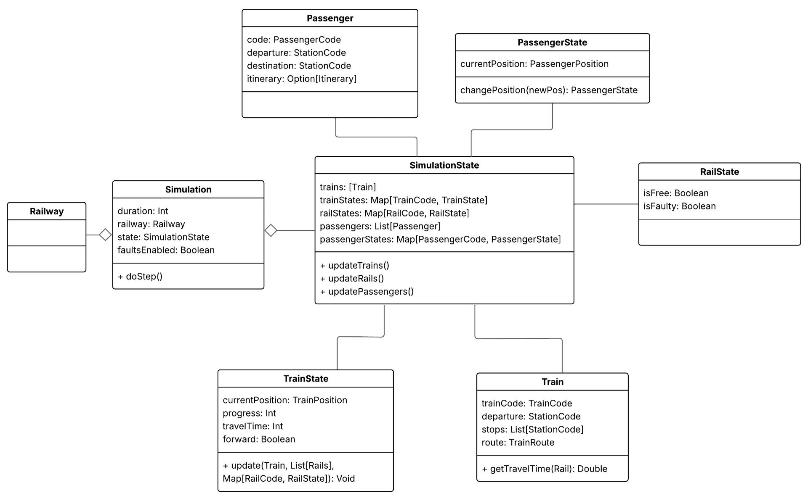
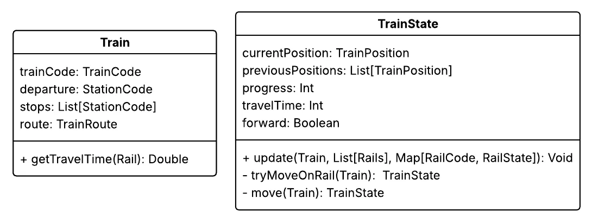
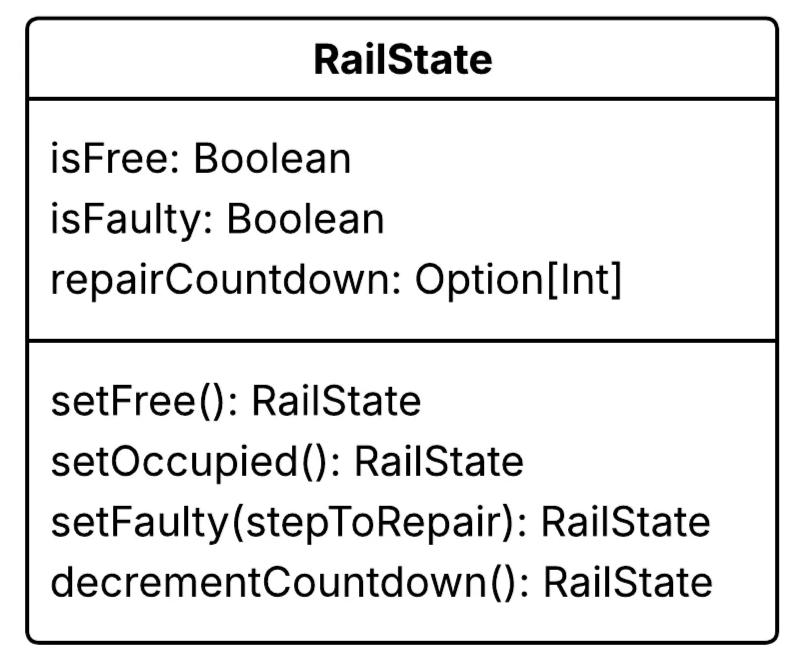
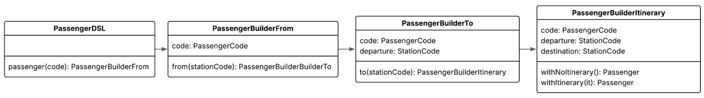
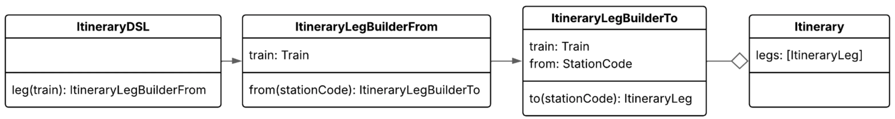

# Design di dettaglio

# MapGrid

MapGrid è la rappresentazione della griglia della mappa della simulazione, contenente **stazioni, binari e celle vuote** e gestisce regole di posizionamento, costo e vincoli di budget.

Il design si fonda sull’idea di **immutabilità**: ogni operazione che modifica la griglia produce una nuova istanza, preservando lo stato precedente.

.png)

Le regole di posizionamento, isolamento delle stazioni e rispetto del budget sono integrate nel modello ma rimangono **modulari**: la griglia sa validare la correttezza di una mossa senza doversi occupare della logica dei treni o della simulazione dei viaggiatori. La responsabilità di `MapGrid` è gestire lo stato della mappa e garantire che tutte le regole di costruzione e i vincoli siano rispettati.

Il design è inoltre **estendibile**: è possibile aggiungere nuovi tipi di stazioni o binari senza modificare la struttura della griglia, perché ogni nuovo pezzo eredita dal tipo generico `Cell` e implementa le proprie regole locali. Allo stesso modo, la logica di adiacenza e validazione delle configurazioni rimane centralizzata e riutilizzabile, evitando duplicazioni.

Una volta terminata la progettazione, la griglia verrà convertita in una struttura più di alto livello dove i “blocchi” posizionati diventano vere e proprie entità utilizzate durante la simulazione.

# Railway

La `Railway` è la struttura statica della rete, derivata dalla mappa a blocchi disegnata, e la sua rappresentazione è strutturata in modo da essere facilmente convertibile in un grafo per il calcolo delle tratte. È composta da una lista di `Station` e da una lista di `Rail`. 

Un `Rail` rappresenta un binario e, come tale, ha una lunghezza e il codice delle due stazioni alle quali è collegato, salvate in maniera generica come `stationA` e `stationB`, dato che non hanno una direzione di percorrenza. Inoltre, un `Rail` è in grado di accettare o meno un treno, in base al suo tipo.

.png)

# Simulation

Il `SimulationState` è la classe che mantiene lo stato complessivo della simulazione, eseguendo l’aggiornamento dei singoli componenti. 

## Viaggiatori

Nel corso della simulazione, i viaggiatori e le loro posizioni vengono gestiti tramite le strutture dati `passengers` e `passengerStates`. La mappa degli stati viene aggiornata, preservandone l’immutabilità.

Ad ogni iterazione della simulazione, vengono generati nuovi passeggeri e vengono aggiornate le posizioni di quelli già esistenti.

Ad ogni iterazione della simulazione, la posizione precedente viene registrata in un vettore. Questo consente, al termine della simulazione, di calcolare statistiche dettagliate sui viaggi effettuati.

## Treni

La gestione dei treni si divide nelle informazioni statiche mantenute nella classe `Train` e quelle dinamiche del `TrainState`. All’interno del `Train` si trova la `Route` che rappresenta la tratta statica da seguire, mentre nel `TrainState` ci sono le informazioni per attuare il movimento del treno.

La `Route` si differenzia dalla lista di fermate perché è il risultato di un algoritmo di ottimizzazione.

Questo permette al treno di percorrere la tratta più breve in termini di tempo, tenendo in considerazione le diverse velocità sui binari, e include anche eventuali stazioni intermedie in cui il treno transita senza fermarsi.

## Binari

Le informazioni dinamiche relative ai binari sono gestite attraverso oggetti `RailState`, organizzati all’interno della mappa `railStates`.

Ogni oggetto `RailState` descrive lo stato di un singolo binario e contiene:

- due variabili booleane, che indicano rispettivamente se il binario è **occupato** o **guasto**;
- un contatore che rappresenta il numero di step rimanenti per completare l’eventuale riparazione in corso.

# DSL

## Passeggeri

`PassengerDSL` è un DSL ispirato al **Builder pattern** per creare `Passenger` in maniera controllata.

Si parte dal codice del passeggero, si definisce la stazione di partenza e poi quella di arrivo, con la possibilità di associare un itinerario o lasciare il passeggero senza itinerario nel caso in cui non sia presente un percorso possibile per la meta scelta.

## Treni

`TrainDSL` è un DSL che implementa il **Builder pattern** per creare treni, rendendo più semplice e automatica la validazione e l’assegnazione delle tratte.

## Itinerari

`ItineraryDSL` è un DSL ispirato al **Builder** **pattern** per creare `ItineraryLeg` in maniera chiara e controllata. Si parte dal train, si definisce la stazione di partenza e poi quella di arrivo, generando un leg già validato.