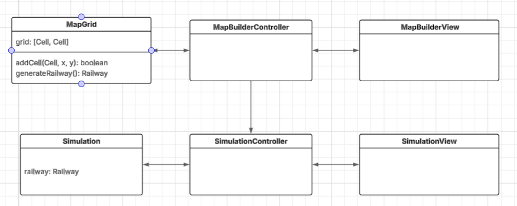

## Design architetturale

### Pattern Architetturale MVC

L'applicazione si divide in 2 parti principali:

*   il configuratore della rete ferroviaria;
*   il simulatore vero e proprio del traffico ferroviario.

Per entrambe abbiamo deciso di applicare il pattern Model View Controller con un collegamento tra i controller delle due parti per passare dalla view per la creazione della rete a quella per la configurazione e l'avanzamento della simulazione.

Tale pattern garantisce una chiara separazione delle responsabilità all'interno del sistema, dandoci la possibilità di modificare i componenti singoli in maniera indipendente, migliorando per esempio la view in un secondo momento, a parità del model.

Quando l'utente disegna la rete ferroviaria, ogni elemento viene inviato al controller per aggiornare la griglia del model. Il model si occupa di controllare che i posizionamenti siano coerenti. Quando l'utente è pronto per avviare la simulazione, il `MapBuilderController` crea il `SimulationController` e scatena la creazione della nuova finestra per la simulazione.

### View

`MapBuilderView` come intuibile dal nome offre all'utente l'interfaccia grafica per il posizionamento dei componenti di dominio in una griglia, così da comporre una rete ferroviaria.

`SimulationView` invece permette di impostare i parametri di simulazione ed osservare la sua esecuzione, mostrando il report finale.

### Controller

`MapBuilderController` si comporterà prettamente da intermediario tra la view e MapGrid mentre `SimulationController` avrà anche il compito di gestire il simulation loop.

### Model

`MapGrid` rappresenta il modello statico disegnato tramite la `MapBuilderView` e verrà convertito in un oggetto `Railway` utilizzato in `Simulation` al termine della configurazione della rete ferroviaria.